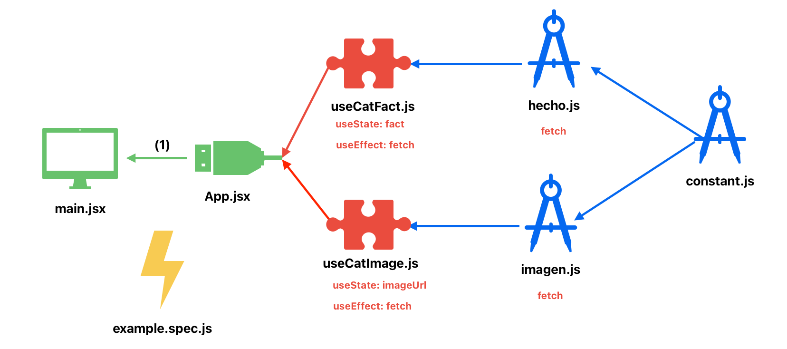
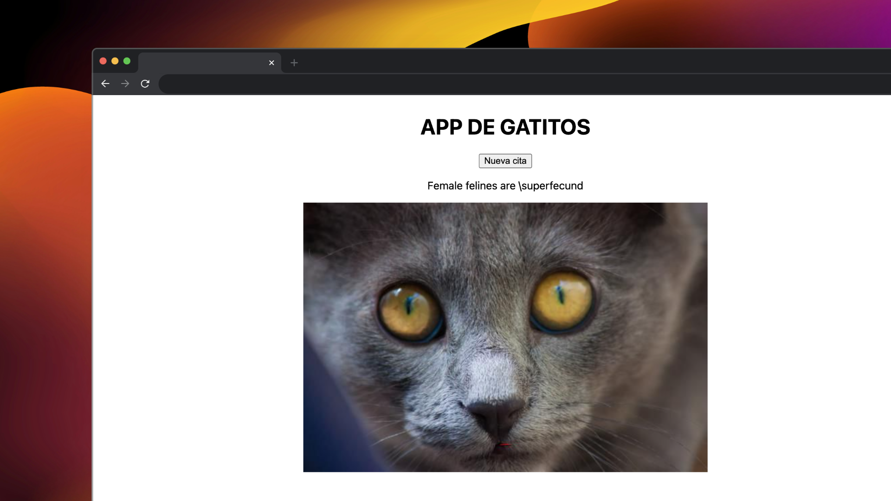

# PRUEBA TÉCNICA TRAINEES-JUNIORS

Es una prueba técnica para Juniors y Trainers de React en Live Coding.

APIs:
- Facts Random: https://catfact.ninja/fact
- Imagen random: https://cataas.com/cat/says/hello

Descripción:
Recuperar un hecho aleatorio de gatos y muestra una imagen de un gato con la primera palabra del hecho.

## 1 COMPONENTES
Solo la ‘App.jsx’

## 6 HOOKS (UseState (2), UseEffect (2), CustomHook (2))
CustomHook (useCatFact())  UseEffect  UseState (fact)
CustomHook (useCatImage())  UseEffect  UseState (imageUrl)

## LÓGICA

Antes de ir a picar código tenemos que leer bien el problema y entenderlo bien y si podemos accedemos a las APIS.

TIP: lo que queramos buscar por Google de documentación a partir de la palabra ‘mdn’ y nunca buscar la solución en concreto al problema específico.

Lo podríamos dividir en varios hitos para ir realizándolo:
- Recupera un hecho aleatorio de gatos de la primera API.
- Recuperar la primera palabra del hecho.
- Mostrar una imagen de un gato con la primera palabra.

Vamos a tener que hacer fetching de datos, y usar dos estados con la trampa de que uno va a tener que depender del otro. 

Normalmente siempre te suelen pedir dos estados y uno que dependa del otro, a veces puede ser con dos fetching de datos o con uno solo y luego tener que hacer algo más específico.

Al finalizar las pruebas muchas veces te van a preguntar ¿y ahora qué harías? La respuesta incorrecta es decir estilos, nuevas features, etc. Lo que tienes que realizar si tienes más tiempo son los tests y empezar con el más básico e importante que es el test EndToEnd.

Hay un problema para empezar un proyecto desde cero, muchas veces no te permiten utilizar de forma predeterminada Vite con React, es decir no te dejan utilizar un template que ya este hecho con React (lo mejor es preguntar al entrevistador si puedes o no utilizarlo de forma predeterminada).

Lo que puedes hacer es instalar lo mínimo de Vite y luego configurarlo. Porque lo que quieren es que inicialices tú mismo el proyecto y crees el punto de entrada.

Lo que conlleva hacer Vite con Vanilla (JS puro) en vez de seleccionar React para luego pasarlo de forma manual de Vanilla a React y nosotros ponemos el punto de entrada.

Ahora deberíamos instalar un plugin de React (para eso no te van a dar problema porque lo que quieren es ver como creas el punto de entrada de la aplicación, npm install @vitejs/plugin-react -E). Al final vas a tener que crear la configuración del plugin asique no va a ver problema.

Nos pasara cuando no veamos luego en el ‘package.json’ la dependencia de React y tengamos tambien que instalarla: npm install react react-dom -E
Igualmente tendríamos que crear el archivo de configuración de Vite.

Saber que siempre el ‘main.js’ es el punto de entrada de la aplicación y como es el primer archivo que se va a cargar en mi aplicación, hay que importar el ‘createRoot’.
Dentro del root es donde voy a querer renderizar mi aplicación.

TIP: hay que evitar siempre que la pagina este en blanco, hay que estar enseñando constantemente algún progreso.

Importante instalar ‘esLint’ en mi caso instalare Standard, pero puede ser cualquiera.

Lo recomendable es que el punto de entrada de la aplicación lo dejemos tranquilo y no lo volvamos a ver más. Por ello creamos una carpeta ‘src’ con la ‘App.jsx’ y hay ya construimos nuestra aplicación.

Pensamos primero en el 1 HITO: Recuperar un hecho a aleatorio de la primera API.

Creamos un estado (useState)  para cambiar el hecho aleatorio.
Ahora crearemos un efecto (useEffect) que es la forma más básica para crear fetching.
Porque si creamos un fetch fuera del efecto se ejecutaría cada vez que se renderiza nuestro componente, asique cada vez que se ejecutara, al cambiar el estado, haríamos un loop infinito donde constantemente se cambiaria la imagen.

Vamos a acceder a las APIS para saber cómo nos las dan y que es lo que devuelven.
(ya que muchas veces nos dan la documentación para que busquemos la API).

Luego ya creamos el useEffect para meter dentro el fetch (se puede hacer síncrono o asíncrono) y poder recuperar el hecho. De momento sin dependencias con [] que se cambiar solo al principio del renderizado (si quitamos el [], sería un loop infinito que se renderizaría constanmente).

2 HITO: recoger la primera palabra del hecho y hacer el  segundo fetch de la imagen.

Tenemos que crear un nuevo useEffect porque una buena práctica es que cada useEffect solo tenga una funcionalidad.

En este efecto es donde recogeremos la primera palabra del hecho y haremos un fetch para mostrar la imagen.

Asique vamos a crear un nuevo estado (UseState) igual que hicimos para el hecho, ahora para la imagen.

Tambien está bien tener manejo de errores (dentro del fetch) en la prueba pero que no sea lo primero que hagamos.

OJO: useEffect no puede manejar funciones asíncronas directamente.

Y es importante sabe dar los estilos básicos si nos lo piden. Ahora pueden llegar y decir esto está bien, pero quiero que la imagen tambien quede centrada. Y nosotros deberíamos de preguntar ¿si es así con estilos en línea o separados? Si te dicen que no hay problemas hazlos en línea, sino los sacas que es como lo vamos a hacer.
De CSS hay que saber una cosa que es super importante que es Flex, tenemos que saber alinear elementos con Flex.

Siempre suelen pedir que añadamos un botón para refrescar los cambios, en este caso el hecho con la imagen, porque quieren ver que sabes reutilizar la lógica con un servicio o al menos en un mismo archivo. 

TIP: No hay que ponerse a crear un montón de componentes que si no va a constar un montón y no nos sobra el tiempo en una entrevista.

Una vez conseguido todo el funcionamiento en la ‘App.jsx’, es un buen momento para separar todo con un poquito de lógica. En vez de empezar a separar en componentes vamos a separar primero los fetch cada uno en un fichero (js9.

TIP: Siempre hay que evitar pasar el estado de cambio (setState) hacia fuera, así no usaríamos ninguna dependencia de React para que sea reutilizable con otros componentes.

Y los useEffects después ya lo podemos usar en CustomHook (jsx) (que aquí sí pueden haber estados porque son componentes especiales de React), uno para cada useEffect, donde podemos heredar los estados para que tampoco se encuentren en la ‘App.jsx’.

Cada vez que veas un UseEffect (llamada a algo externo de React) pregúntate si debería de separarlo en un CustomHooks porque normalmente tienen carga de lógica que vas a querer reutilizar y separar y no vas a querer que este en mitad de tu componente.

Lo bueno es que ahora son reutilizables las funciones con Hooks creadas como Custom Hooks.

TIPS: Preguntas que suelen hacer al final del proyecto para mejorarlo.
No se te ocurra decir hacer más features. Lo que tendríamos que hacer es handle de errores, y sobre todo testing. Y si te dicen que si te atreves a hacer alguno dices que si por lo menos el más básico, en END TO END.

Para el testing, habría que instalar: npm init playwright@latest
No vas a poder ver si la imagen es la correcta, pero si se ha renderizado un texto una imagen y ya es algo.

### ESQUEMA 

  

### INTERFAZ 

  

